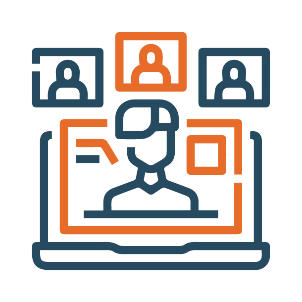
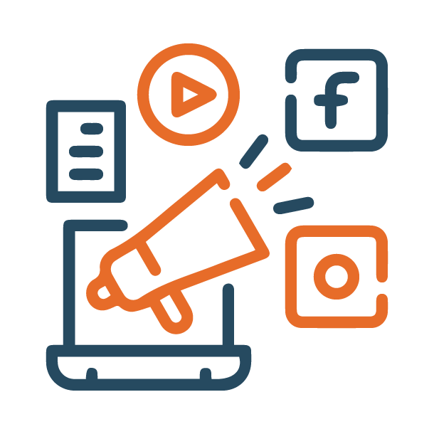
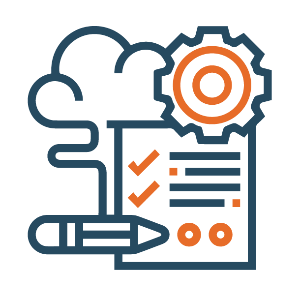

Welcome to a new worldwide landscape. It’s obvious that the global surge of the **coronavirus** (COVID-19) has been a huge blow to the global economy and it’s having a major effect on businesses around the world. 
Although many governments around the world have announced measures to alleviate the burden, most businesses cannot carry on as normal and will have to adapt to the new circumstances.
This will be a different period for everyone, but it’ll also be the perfect moment to reconsolidate, regroup, put new ideas to the test and innovate. While adapting for this new era to keep your employees safe and your business productive,  you may discover a newfound strength that’ll give you solidity in the long run.

<title-2>Here are some useful tips to keep in mind at coronavirus time:</title-2>

<title-3>1. Identify the challenges for your business</title-3>

The best starting point is to elaborate on a list of challenges your business might face with coronavirus changes. 
It’s essential to strategize for different scenarios and take every possible development into account.
Consider everything from the disruption of supply chains to difficulties in communication, generating customers, and competition with other businesses in your market. Regardless of how you think the outbreak is going to pan out and how it might affect you, plan for every conceivable scenario, including the worst you can imagine.
Small and medium businesses can have challenges with the commercialization and internal processes of production, but do not worry; there is no challenge that process automation can not resolve.

<title-3>2. Stay healthy and safe</title-3>

While many businesses can transfer most of their work online, some aren’t so lucky. For those who still need people in the office or another working environment during the coronavirus outbreak, you must undertake a comprehensive health & safety risk assessment.
On a fundamental level, this will mean more frequent cleaning, as well as limiting physical contact between people. All of this could impact on your routine, and compromise the safety of your facilities and employees.
But the reality is that almost every company in the world would improve its processes and keeping safe the employees. Just is needed investment, and maybe software options.

<title-3>3. Work from home (remote teams)</title-3>

Many small businesses already allow employees to work from home on certain occasions, and already have the infrastructure to accommodate this, even if it needs to be upgraded. 

Others may find it a challenge to coordinate people online and to undertake simple processes such as meetings, time allocation, or working together on the same project.

Thankfully, there are a whole host of software suites and websites designed to help you with this. Messaging apps such as [Slack](https://slack.com/intl/es-ar/) and [Microsoft Teams](https://www.microsoft.com/en-us/microsoft-365/microsoft-teams/group-chat-software) allow you to form ‘chatrooms’ for different projects, which everyone can see, keeping relevant messages in one place. Many video conferencing tools meanwhile - including [Skype](https://www.skype.com/en/), [Zoom](https://zoom.us/), [Discord](https://discord.com/), and [Hangouts](https://hangouts.google.com/) - have raised their limit for simultaneous users to allow larger video calls for free.

All of these processes will inevitably take some time to get used to, perhaps more so for some employees than others. But they could also be a fantastic opportunity for your business to modernize, and to digitize your traditional workflows. The result could be not just greater flexibility in the future, but making your business more efficient and effective.

If you are not convinced of any of these tools, we can develop it together, 100% customized. The remote [workflows](https://cobuildlab.com/blog/workflows-in-your-business/) are unstoppable, and you can get a lot of benefits from adopting it.

<title-3>4. Adapt your marketing strategy</title-3>

While the immediate instinct may be to dial back your marketing budget during the coronavirus outbreak, it could be more important than ever. 
There are more people sat at home on the internet than ever before, meaning that money spent in the right places could have added value. Ask yourself whether your product or service could be of additional use or relevance in the midst of the coronavirus crisis, and adapt your marketing strategy to reflect this, especially if you’re introducing an altered service for the duration of the outbreak.

Increased and flexible marketing is also crucial right now because many people will wonder whether certain businesses are still operational. Make sure your target audience knows you’re open and still going strong. That is possible for directing the right marketing strategy.

<title-3>5. Improve your delivery system</title-3>

While some products and services are purely physical, others could be adapted to be delivered at home and ordered online. From consultancy to classes to simple business deals and meetings, you may be able to keep your virtual doors open even as your physical ones close.
You should look to adapt the copy on your website to reflect this and project the message that you’re still open for business - just that the way you’re conducting it has changed. This means correcting mentions of site visits as a matter of course - or at the very least, placing a banner across the site to point people towards an information page.

<title-3>6. Prepare for the unexpected</title-3>

With uncertainty lingering over the spread of the coronavirus and how long it is likely to last, you must plan for every eventuality, and stay up-to-date with the latest news.  
You should consider all of these relationships carefully, and make pragmatic decisions that are also based on solid evidence -not getting rid of things you need just because they’re expensive. Think about what the most valuable aspects of your business are and how you can best adapt to the current situation. Given current projections, it may be worth investing the time in focusing on one part of your business at the expense of others or pivoting altogether.

Even though there are no ideal solutions for everything, these tips can help you isolate yourself from the threat that the **coronavirus** crisis represents, and hopefully, come out stronger in the end. We are to help you, and develop the software will help you to automate your process. Just contact us!
