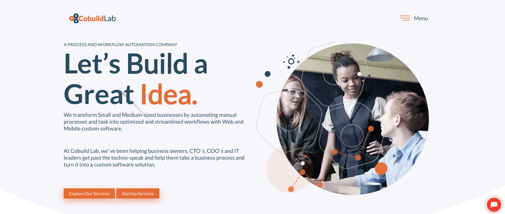
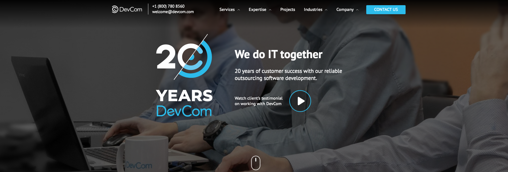

You can say that small business owners are the unsung heroes of our economy. They contribute to local economies by bringing growth and innovation to their communities and they help stimulate economic growth by providing employment opportunities to people who may not be employable by larger corporations.

In these last few months, the situation has become harder for them. With so much uncertainty about the spread of the disease, it’s hard to predict the effects of COVID-19 on B2B commerce. Every crisis of global proportions always takes its toll on the economy and decimates startups, SMBs, and enterprises equally, and business owners are caught in the frontline of the battle against COVID-19. 

With all of the restrictions put into place by governments all around the world, we wonder what’s next and what can we do to keep our business afloat. An alternative is the **process automation and new software solutions** applied to **B2B** and **small businesses** in the US and the whole world. 

<title-2>B2B software: a Great Option for Small Businesses</title-2>

As a manufacturer or wholesaler, if your customers are independent retail stores, retail chains, c-stores, or distributors, you are selling business-to-business (B2B). Sales, marketing, accounting, and support software all help you serve your business customers in the best possible way – and that’s exactly what the term “B2B software” refers to. It can help you automate several of your processes and manage some of your assets remotely.

If you're in this business, here's a video of what could happen to you this 2020 and beyond.

 

<youtube-video id="B-t0DOp0xJQ"></youtube-video>

 

<title-2>Small businesses: Common Problems and its Software Solutions</title-2>

Now, let’s go over some of the most common issues that B2B companies and small businesses face during these times and some of the software solutions they can implement to stay afloat and ahead of the competition:

<title-3>1) Customer Service</title-3>

Customer service is the support you offer your customers — both before and after they buy and use your products or services — that helps them have an easy and enjoyable experience with you. It goes far beyond the traditional telephone support agent. It’s available via email, web, text message, and social media.

* **The Problem:**
The unexpected increase in demand for customer service has hit contact centers at a time when the customer service workforce is at a reduced capacity due to work-at-home constraints and the unfortunate case of agents falling ill due to the coronavirus.

* **The Solution:**
Automated customer service is a method of consumer support that is provided by an automated system such as a help center, chatbot, or other artificial intelligence. Automated customer support can be provided 24/7 and is used to both assist and reduce the cost of human support representatives.

<title-3>2) Product Distribution</title-3>

Distribution is a key element of any business, it guarantees the delivery of the product from the manufacturer to the customer.

* **The Problem:**
If bottlenecks happen in distribution, deliveries fall short, customers, retailers, and suppliers get angry, and trust is lost. For product distribution to be truly successful a continuous feedback loop needs to be implemented to ensure everyone is happy with the process and that any improvements that can be made are made.

* **The Solution:**
Implementing wholesale distribution software can make the range of workflows that you deal with daily much simpler, so you can go from working extra hard to complete a smaller amount of tasks to automating functions and conducting more business than before.

<title-3>3) Internal Communication</title-3>

Internal communications are all about promoting effective communications among people within an organization. It involves producing and delivering messages and campaigns on behalf of management, as well as facilitating a dialogue with the people who make up the organization.

* **The Problem:**

Without some kind of oversight, communications within the company can easily miss the mark. Some of the symptoms are:
Lack of employee engagement.
Irregular communication.
Communication inconsistency. 
Lack of feedback. 
No interdepartmental communication. 
Email overload

* **The Solution:**
Internal communications software can provide users with platforms that allow for direct and group messaging within the organization. These tools aim to be intuitive and convenient, facilitating quick conversations between team members. Gone are the days of sending sentence-long emails to receive one-word responses. Its key benefits:
Instant communication between team members.
Allows teams to connect regardless of location
Makes messages easily searchable
Provides a less formal virtual workspace for team communication
Connects the organization horizontally and vertically 

<title-3>4) Manufacturing</title-3>

In manufacturing, your money is made on the shop floor. That is why real-time availability of every detail involved in the entire manufacturing operation is crucial to the continued growth, success, and profitability of your manufacturing business. 

* **The Problem:**
As the COVID-19 pandemic sweeps across the globe, manufacturing organizations face significant operational challenges. Some companies have temporarily shuttered factories in response to government restrictions or falling demand, but others are facing significant increases in demand for essential supplies.

* **The Solution:**
A complete manufacturing software solution will prevent unnecessary downtime while increasing manufacturing efficiency, quality, and profit margins. The right solution can help you:
Eliminate non-value added processes

Eliminate non-value added processes
Eliminate unplanned downtime
Prevent bottlenecks in the manufacturing process
Operate with near 100% machine utilization
Optimize scheduling and resource allocation regardless of the plant location
Have complete unimpaired visibility and traceability of the entire manufacturing process from raw material, through customer delivery
Comply with quality standards

<title-3>5) Manual Processes</title-3>

Lots of small businesses rely on manual processes on their day to day operations like using spreadsheets, filing cabinets, or using handwritten orders.

* **The Problem:**

These old school methods end up causing delays and unnecessary paperwork that slows down the workflow. Add to this the current limitations on staff due to the spread of the coronavirus and you’ll see that the time has come for a software solution that can help you on this issue. 

* **The Solution:**

Automation of back-end processes frees up staff time. Apart from the obvious benefits of efficiencies achieved, staff released from mundane tasks can focus on more creative jobs or acquiring new skills. It’s a software solution that can have a tremendous positive impact on your business.

<title-3>6) Customer Relationship Management</title-3>

They’re the ongoing connection between a company and its customers. This relationship involves marketing communications, sales support, technical assistance and customer service. The relationship is measured by the degree of customer satisfaction through the buying cycle and following receipt of goods or services.

The Problem:

In this era of dwindling staff numbers due to the global crisis, it’s easy for customer relations to go south, especially on the B2B market. The classical symptoms include:

Poor communication 

Customers kept waiting 

Inflexible appointment times

Missed appointments 

A general lack of initiative

The Solution:

A Customer Relations Management ([CRM](https://cobuildlab.com/blog/enterprise-software-solutions-tools/)) system It’s a platform that connects your different departments, from marketing to sales to customer service, and organizes their notes, activities, and metrics into one cohesive system. Every user has easy, direct access to the real-time client data they need. The benefits of this kind of software are great

Maintain a centralized database across your sales org

Manage all communication and interactions with prospects

Automate data entry

Be reminded to follow up with prospects

Organize contact data

Segment customers

Create sales reports

Automate forecasting for your sales performance

Scale your sales processes over time

Ensure team communication is facilitated

Keep the same software as your company grows

Make administrative tasks efficient

Source: [hubspot](https://blog.hubspot.com/sales/benefits-of-crm)

<title-3>7) Project Management</title-3>

Project management is the practice of leading the work of a team to achieve goals and meet success criteria at a specified time. The primary challenge of project management is to achieve all of the project goals within the given constraints. Project management software creates and keeps the [workflow](https://cobuildlab.com/blog/workflows-in-your-business/).

* **The Problem:**

Incidents and problems can cause failures in service delivery or service degradation. Therefore, the problem management process aims to prevent problems mainly. The problem management process also finds the root causes of incidents which are causing problems and seeks to find a persistent solution for these causes.

* **The Solution:**

Project management tools come with the necessary features you need to efficiently plan your projects, manage available resources, respond to problems, and keep customers and employees happy. Regardless of the type of services your business offers, having the best project management software can make a significant impact and help you achieve many goals like:

Easier Collaboration.

Better Scheduling.

Better Communication with Clients.

Delegate Tasks More Easily.

Budget Management.

Document Sharing and Access.

 

<title-2>Software Solutions for Your Small Business</title-2>

There’s a lot of options in Florida for small businesses and B2B companies looking for a software solution in some area of their work.

 

<title-3>CobuildLab</title-3>

 

 

We transform Small and Medium-sized businesses by automating manual processes and tasks into optimized and streamlined workflows with Web and Mobile custom software. At [CobuildLab](https://cobuildlab.com/), we’ve been helping business owners, CTO’s, COO’s and IT leaders get past the techno-speak and help them take a business process and turn it into a custom software solution. Here at CobuildLab, we can help you find the right solution. Check out our work with [Massone Mechanical](https://cobuildlab.com/customer-success-stories/massone/), one of our local process automation experiences.

 

<title-3>DevCom</title-3>

 

 

Established in 2000, [DevCom](https://devcom.com/) is a reliable software development partner for clients worldwide, that provides complex software engineering solutions and services covering the full project lifecycle, from concept to polished product.

 

<title-3>Grata Software</title-3>

 

 

[Grata](https://www.gratasoftware.com/) specializes in high-end solutions for internal business process optimization, B2B and B2C marketing, custom software development, SaaS, and e-commerce. Based in Orlando, Grata partners with Amazon Web Solution Consulting to deliver reliable and robust applications.

<title-2>This is Our Experience on Process Automation and B2B processes</title-2>

**Massone Mechanical** sought to improve its processes in terms of customer service delivery and information management, mainly needed to automate the recording of calls or service orders maintenance or installation of refrigeration equipment, improve communication of services, and reception of them to field workers.

We met the Head of IT for Massone and started working on possible solutions to improve the workflow for the company, we tried a different version of ERP applications and Third Party solutions. We realized that a Custom Application needed to be developed and we spent several months reviewing the current process on the Company and what to do to improve them. Finally, we locked down a budget to start with the solution around September of 2018 and in January 2019 we released the first version. New features have been added until today with complete satisfaction from the customer.

**This is how the developed software looks like:**

 

 

 

<title-2>CobuildLab: Creating Custom Software Solutions For Your Business</title-2>

In Cobuild we’re ready to help you find the software solution that you’re looking for. Our process is very simple and goal-oriented in order to provide you with the best course of action and not waste time or resources on this critical time for small businesses everywhere.

1) We evaluate your business and everything it needs to operate correctly
2) We study the technologies available to automate your processes or create a software solution that fits your needs.
3) We make a proposal, we discuss it with you and determine a budget.
4) We develop and apply the solution for you. 

Out of conflict and crisis always comes opportunity and chances to improve. The time to make significant changes that could dramatically improve the performance of your business it’s right now. If you’re looking for solutions for your business in Florida or the US either for process automation, distribution, manufacturing, communications, or any other area of work within your company, [contact us](https://cobuildlab.com/) and let us help you find them.
