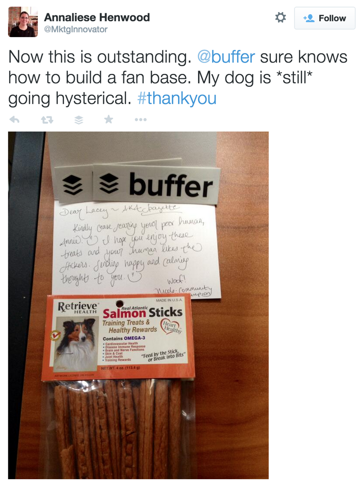

**Humanize your brand**. If we have to choose the 10 commandments for brands this year, this would be number one. 

A human face and feel, make that potential customers connect with brands because they feel related.

This is more than a trend, it is a commandment because humanizing your brand you will be able to catch, convert, and get loyal people. Sells are implicit. Actually, we include this element to the [trends for 2019 on social media](https://cobuildlab.com/blog/social-media-trends-for-2019/).

<title-2>What is humanizing a brand?</title-2>

Humanizing a brand is getting It more human, tell stories and show the whole people that are behind the brand or people who are related to the brand. 

Humanizing a brand is a work that you should do in every digital platform that you have. We mean, on your website, your social media accounts, emails, etc. 

Every day you should do It, and following the next pieces of advice you Will do It successfully.

<title-3>1. Tell many stories; authentic stories</title-3>

In your feed, in your Instagram stories, in Facebook stories, in every web platform you have, and if you accompany that story with an image or a video the result will be even better. 

Stories about what? All it will depend on your brand qualities and your customers’ profile. 

If you have a personal brand you could say what you learn in a day, which alliances you are doing now, what is your favorite food and why. This kind of information is appropriate for sharing in social media and web platforms. 

If you have a corporate brand, a story that you could share is in what is working your team, stories behind your employees, team achievements, even jokes, team meetings. If you are brave enough you could share these things (failures, hardships, and lessons) that are not so good and also happen in your daily teamwork. 

“According to Psychological Science, research suggests that shared pain may have positive social consequences; shared pain acts as a “social glue” to promote solidarity and togetherness between groups.”

[Newstime](https://www.newstimes.com/news/article/5-Things-You-Can-Do-to-Humanize-Your-Brand-13514289.php)

Your followers will love this kind of content, actually, they could feel identified because they are human and all of these things also happen to them. This will not only humanize your brand, but also it will boost sales.

<title-3>2. Let your clients know how important they are</title-3>

Humanize a brand is also possible if you give to your clients a specialized and personal treatment. What does it mean? Well, call them by his or her name, personalized messages and offers, bring them personalized gifts, attending the customers’ requirements immediately, making suggestions, offering special discounts, and talking person by person with them. 

Also, you can make events, send emails, and every action to give them a personalized treatment. 

That will give to your brand a human feeling. 

In that way, clients will be more than a client, they will be a fan of your brand. They will be loyal to your brand and ambassadors of her. 

An example of that is the next: “Buffer thanked one of its stand-out customers with not only company swag, but a personalized gift”.

[Newstime](https://www.newstimes.com/news/article/5-Things-You-Can-Do-to-Humanize-Your-Brand-13514289.php)

This was the answer:

Source: [Open.Buffer](https://open.buffer.com/community-delight/)

<youtube-video id="AiCwm8Gf-ts"></youtube-video>

<title-3>3. Share all content that your clients generate</title-3>

When we say all content, we mean to the whole content related to your brand. Experiences that will make more human and authentic your brand.

It is more than a review. It could be a comment on your website, a publication in their social media account, and every publication they make about their experience using your product or before enjoy your service. 

Even you can share comments or private chats where they are thanking you or making a good comment. 

A good place for sharing this is the stories in social media platform. Potential customers will see these experiences and they will be attracted to have your product or service to feel the same. 

“What your user says is the best publicity for every brand in the world.”

Especially on the internet. 

“Instead of being asked to blindly trust a company’s claims, consumers will see real-life people falling in love with your products, which will promote trust in your brand”.

<title-3>4. Show your team members as much as you can</title-3>

Even if you offer a product, your users could be eager to know the people is behind than the same product. 

Bigger brands in the world do it and they have gotten an amazing result with this technique. 

This example of Starbucks sums it up well. 

Is not necessary that the information you bring has been about the work. It could be about their life. But don’t get confused. It is necessary that you tell the employees’ story related to their work and your brand. 

The employee of the month, a story about what makes that staffer so great, and that is the kind of content that your client would love in your website and social media account.

<title-3>5. Shows a funny side of your brand</title-3>

Some laughs always are good and when it's about relationships between brands and customers it is good too. 

Scientists from urku PET Centre, Oxford and Aalto universities discovered that when people have social laugh leads to an endorphin release in the brain and that helps to establish social bonds. So, if laugh improves social connections you can take advantage of them and use them in favor to your brand. 

You don’t have to be a comedian, with share popular, viral, and funny content is enough. 

But remember, this funny content should be related to your product or service. At least with a characteristic of your brand. 

This is a good example of this. 

Netflix is the best brand to understand it. 

<title-3>6. Interact fast and directly through your social media accounts</title-3>

Interactions are the best weapon for humanizing a brand. If a person answer all questions, comments, and suggestions fastly and as a human, these clients will feel confident and they will know that behind the brand there are nice people. 

Use emoticons, be polite and kind. That will give a good impression. 

<title-3>7. Share a balance between personal information and commercial information</title-3>

Nowadays, the big influencers and brands tell to their followers, clients, and community personal quotes, phrase, culture, and information that alone could be not interesting, but in a web platform and accompanies with commercial information will be a condiment. 

We propose a percent of 40% of personal content, and 60% of commercial content. But be. Commercial content indirect. Or how we say, content that sells without sell. Be as creative as you can! 

From now, be the best friend of your clients and make them loyal to you. Humanizing your brand It will happen. If you want more tips and actions to achieve the goal of **humanize your brand**, communicate with us, and we can do it faster together. 

