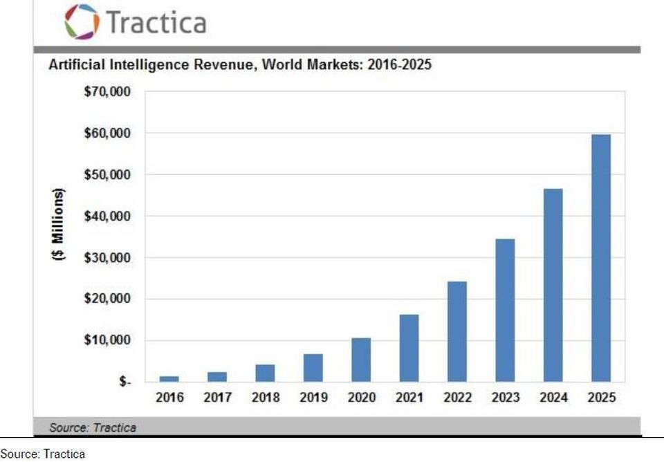

While real artificial intelligence hasn’t truly been achieved yet, businesses are taking advantage of intelligent automation, like machine learning, to improve business operations, drive innovation, and improve the customer experience.

**AI** and automation are transforming the business environment in all industries, offering new opportunities through intelligent and automated products. Some companies are ahead of the curve, and others are stagnating in their adoption of the technology. Board members and decision-makers are increasingly aware of the benefits of AI and automation, but the question should always remain: ‘Is it right for my business? How does it solve a problem?.

With the general rise of this technology into business operations also comes challenges, dangers, and potential risks to the human workforce. This feature will examine all these aspects and hope to give an overall look at AI and automation in the enterprise.

<title-2>First, What is AI?</title-2>

Artificial intelligence (AI) is effectively a term to describe processes of intelligent automation, like machine learning, natural language processing (NLP), cognitive computing, and deep learning. 

True AI is when a computer or robot can think and act as a human brain would. At the moment, companies are using autonomous processes to improve operations, and change the face of customer service (through, for example, AI-powered chatbots), while spurring innovation to new heights. AI is a set of algorithms that can solve a specific set of problems — and it works best with a large amount of big quality data.

<title-2>The market of AI in the enterprise software</title-2>

Market forecasts vary, but all consistently predict explosive growth. IDC predicts that the Cognitive Systems and AI market (including hardware & services) will grow to $47B in 2020, attaining a Compound Annual Growth Rate (CAGR) of 55%. This forecast includes $18B in software applications, $5B in software platforms, and $24B in services and hardware. IBM claims that Cognitive Computing is a $2T market, including $200B in healthcare/life sciences alone. Tractica forecasts direct and indirect applications of AI software to grow from $1.4B in 2016 to $59.8B by 2025, a 52% CAGR.

**Source:** [Forbes](https://www.forbes.com/sites/louiscolumbus/2017/06/11/how-artificial-intelligence-is-revolutionizing-enterprise-software-in-2017/#7ac473e82463)

<title-2>The benefits of AI: is it necessary?</title-2>

AI and automation, like some other emerging technologies, will allow businesses to cut costs, boost productivity by freeing up workers from more ordinary tasks, increase agility and flexibility, and spur innovation — all the buzzwords.  AI and automation stand out from other technologies, in that it will help advance those other technologies into the mainstream enterprise environment. 

<title-2>Integration challenges</title-2>

 If the leadership team of an organization does decide to integrate AI and automation, then there will be some challenges to overcome, including control, a lack of skills, and legacy systems.

<title-3>AI and control</title-3>

Businesses must be able to control the scope of how it’s AI makes decisions,  the ability to change from opaque, where the decisions being made by the AI are not easily explainable, where they need to insist on it being transparent and able to explain its results. 

<title-3>Lack of skills</title-3>

The global digital skills crisis has been well documented, and any organization looking to integrate AI and automation processes will need employees who can work with, and understand the technology. Industry at large will need more data scientists who are also domain experts and understand the relevance of the training datasets as they conduct regression and optimize their ML algorithms.

<title-3>Legacy systems</title-3>

Many large enterprises are based on legacy systems, and integrating any new, emerging technology with these is a challenge. Many businesses face the challenge of working out how automation fits in with existing systems and processes.

<title-2>Artificial intelligence trends for enterprise software</title-2>

Despite challenges, more are the benefits of Artificial Intelligence used for improving business processes. We share this video where you would see what we are talking about. 

Take advantage if you have a business that needs an update. 

<youtube-video id="-i9gn4NH4KU"></youtube-video>

The workspace is gradually going through an evolvement, and this will, in years to come, an increase in a geometrical rate due to the import of artificial intelligence. CEOs make more money; recruiters save energy, employees go through less stress, and the masses are enjoying transitions in different facets of life. Hence, the transformation that comes with **AI** only caused a ripple effect on productivity in the industrial world.
