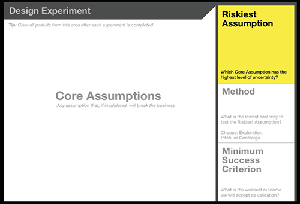
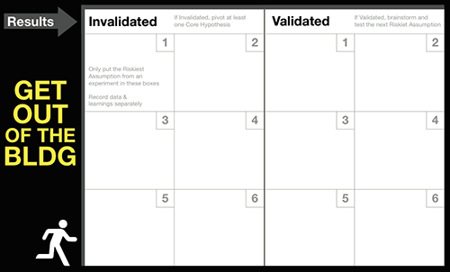
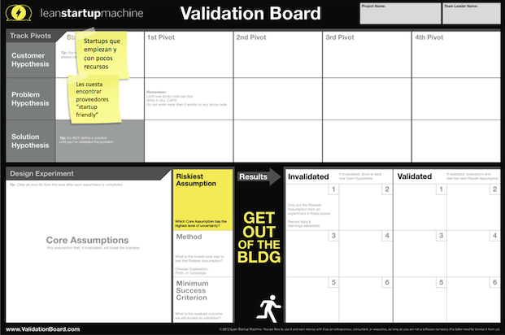
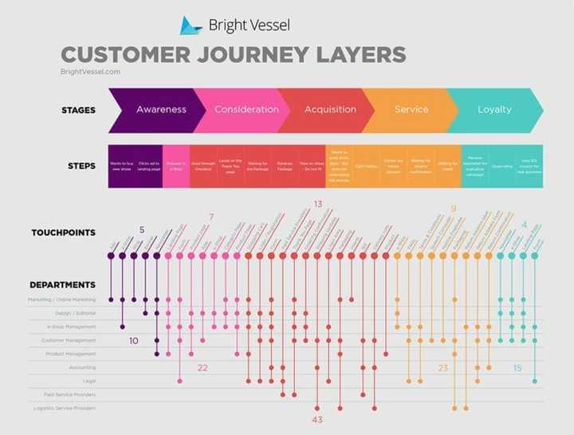

One of the main steps in the Cobuild process is [the validation of the business idea](https://cobuildlab.com/blog/validating-your-idea-the-first-step-to-create-your-startup/). It is within the first three phases. 

Without this, we can say that a software product does not have a good foundation. Therefore, not only we will show you the importance of this step, but we will also give you some **practices and tools that will help you validate your business ideas** easily and effectively.

<title-2>Once again, what is the Idea Validation step?</title-2>

Validation of the idea is a step within any business, whether software or not. Basically, it is to apply methods to learn more about customers, the market, and the needs that exist, to conceive a product that has a better chance of success.  

This step is focused on three premises: 

1. The problem that you are planning to solve with your proposal already exits 
2. That there are enough number of people who have this problem to make a profitable market
3. And even most important, that the solution you are proposing is desired or expected to solve this problem. 

**Validating your business idea is to confront your idea with the real world and know if it has the potential to work in it.**

This is the tripod of the idea validation. The base for completing this step of the Cobuild process.  

If you want to know more details about this topic, [you can visit this post that we made talking about the idea validation generalities.](https://cobuildlab.com/blog/validating-your-idea-the-first-step-to-create-your-startup/)

<title-2>Now, let's get into the tools and practices to validate your business idea</title-2>

<title-3>1. Validation Board</title-3>

This method is excellent. It was developed by Lean Startup Machine, and this is our preferred method based on the experience that we have.

The validation board is a canvas based on testing, learning and pivoting, where you can see a set of elements, tools, resources, and items necessary for the business that you have in mind work. In this way, you can measure or at least predict the viability of the idea.

<youtube-video id="HhoducyStMw"></youtube-video>

The good thing about this tool is that having this overview you can make important decisions to improve your hypothesis or some aspect of the business life-cycle that needs to be improved. 

You can literally pivot within the same board. 

**Board structure**

* **Hypothesis and iterations (pivots)**

**Source:** [Javier Megias](https://javiermegias.com/blog/2013/05/validation-board-herramienta-validar-hipotesis-pivotar/)

If you didn't know, by hypothesis we mean the hypotheses of the customers (who is our client), of the problem you identified (delimitation of the problem), and the solution you are offering, which, as we well know, is the basis of the validation of the idea.

* **Design Experiment**

This is the most dreamy and risky area. Here you are going to place all the assumptions or risks that you are going to run with the business model. 

In addition, you define experiments for each one of the assumptions, and you will be able to verify if they are true and effective or if they are not. 

Once you have the experiments, you must define a method to validate them, which the Lean Startup Machine team suggests exploration or a pitch. Enumerate at least three and make a brief description of each one. 

Finally, establish minimum success criteria to help you evaluate whether the assumption or risk pass the test or not. 

Forget at this point the optimism and entrepreneurial idealism.

* **Results Area**

After completing all the previous steps, what will come will be to separate those assumptions that were valid and those that were not.

How do you know if an assumption was validated? Well, they are those that managed to pass the minimum success criteria that we established in the previous section of the board. 

So if you don't overcome it, it means that you will be in the area of an invalid hypothesis. But don't worry, all of them can be moved back to the top zone, that is, the first phase, to pivot the problem again, or the client's need, or perhaps improve the solution, and find one that does pass the tests.

That's what it how it should look at the end:

This tool to validate a business idea is fantastic! but there are also others that we will show you below.

<title-3>2. Customer Journey Maps</title-3>

This tool is also incredible, one of the legacies left to us by [Design Thinking](https://www.interaction-design.org/literature/article/5-stages-in-the-design-thinking-process).  It is a visual representation which contains the customer’s process until he reaches a goal with a certain brand, which in this case, would be yours.

With this tool what is sought is to understand much more accurately how the client thinks and acts, what motivates them, what their needs are, their points of contact with your brand and even their weaknesses. 

If you understand it better, you attend it better. 

With this tool, you’ll understand better how the client thinks and acts, what motivates them, what they need, their points of contact with your brand, and even their weaknesses.  
This map contains the possible history of your client with your brand from the first contact to the end. And the good thing is that you can structure your points of contact with him based on the profile and the information you have about his motivations, emotional points, weakness, etc..  

It is a way of representing the experience of a client but focused on the activities and questions you must ask to complete the desired experience in the user and the goal that is to consume you and establish a relationship of loyalty with you. 

* **How to do it?**

You can work with a diagram in a straight line or as a cycle, because if your goal is a lasting relationship with a customer. 

**Step 1:** The points that should be placed are the points of contact or touchpoint that you will have with your customers, such as social networks, a website, ads, an interview, a newsletter, among others.  

**Step 2:** On the other side, you must place the stages in which you are going to introduce the person, which may well be: awareness, consideration, acquisition, service, loyalty.  

**Step 3:** There must also be the actions you're going to take at those stages and through the touchpoints, and if you want, they can include which team or person will be responsible for that. 

* **Specifically what you get out of this**

In this way, you will build the user experience and then confront it with reality, with information you gather from interviews of a population that corresponds perfectly to your target. In this way, you validate or invalidate the information you planned for the experience you are going to give the user in your business idea. 

With this information, you can also calculate the economic, human and technical resources you will need to carry out your project. 

People often use infographics to represent a Customer Journey Map but also is possible to do it using a video or even a storyboard. 

This is what a Customer Journey Map looks like.

**Source:** [Bright Vessel](https://www.brightvessel.com/customer-journey-map-2018/)

<title-3>3. A landing page can help you too</title-3>

A landing page is simple, easy to handle, very concrete, self-descriptive. There you can explain in a concrete and concise way the problem you observed and the solution you are offering.

If you optimize it with SEO techniques or even if you invest a little in SEM to appear in the searches of people who are within your target, the results of this tool to validate your idea will be much better. 

Specifically, how do you validate your idea? Well, inviting people to subscribe to it, with an email to better explain the product and if they want to answer a form where they can share their opinion about the solution that you are offering. 

Even you can take these suggestions and modify what you consider necessary to improve your product. 

This is an example: 

These are just 3 of our lists of **tools or techniques to validate your business idea**. In the next post, we will be talking about some more that you can use for this purpose. Validate your idea and make sure your business succeeds.

