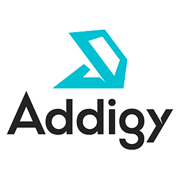

We've heard about the **digital transformation** for a long time, and how important it is in 2020, and we couldn't stay silent about this process that is revolutionizing small businesses and large companies.

Digital transformation is a process of using new technology to improve a business or industry.

Among the most important areas covered by the digital transformation this 2020 we have:  

 

<title-3>[Large data and analysis (Big data)](https://www.atscale.com/blog/digital-transformation-its-still-the-driver-of-big-data-analytics-for-the-data-driven-enterprise/)</title-3>

 

|   | It refers to the study and storage of a large amount of data from one industry or market and the entire ecosystem that makes it up, mainly of customers, suppliers, and competitors. This information is useful to take strategic actions within the company.
|
|---|---|

 

<title-3>[Mobile technology](https://mercury.one/online-business/mobile-driving-digital-transformation/)</title-3>

 

|   | Everything that involves [mobile software development](https://cobuildlab.com/blog/mobile-apps-web-apps-or-cross-platform-what%E2%80%99s-the-best-for-my-small-business/) to consume internally or externally to provide services and increase the quality of services.
|
|---|---|

 

<title-3>[Private and public clouds](https://www.i-scoop.eu/cloud-computing/)</title-3>

 

|   | The digital transformation is also linked to the storage of information, web services, IT infrastructure in cloud servers (public, private, and mixed).
|
|---|---|

 

<title-3>[Artificial Intelligence](https://towardsdatascience.com/3-ways-ai-aids-digital-transformation-4a5965708c45)</title-3>

 

|   | [Artificial intelligence](https://cobuildlab.com/blog/artificial-intelligence-for-enterprise-software/) is another area of technology which if we apply it in our small businesses, we will be on the road to digital transformation.
|
|---|---|

 

<title-3>[The Internet of Things](https://magazine.wharton.upenn.edu/digital/internet-of-things-the-key-to-digital-transformation/)</title-3>

 

|   | When we mix software and hardware development and link the operation of the device to the Internet, not only will we be developing a project of the [Internet of things](https://magazine.wharton.upenn.edu/digital/internet-of-things-the-key-to-digital-transformation/) (IoT), but we will also be directing our small business towards the complete digital transformation.
|
|---|---|

 

<title-2>What is digital transformation?</title-2>

 

We can say that digital transformation brings together a series of technologies to reinvent the processes of different industries, cultures, and customer experiences, in order to increase the production of companies, improving the product’s characteristics and making consumers happier using software and technology.  

Today, digital transformation is very important for businesses since it is the only way that companies can keep up to date, improving their performance. That is why if you want to position your company in the market and be one of the most competitive, you should bet on this type of process without a doubt. 

[It is also important to know that global spending on technologies and services is expected to reach $2.3 trillion by 2023.](https://www.idc.com/getdoc.jsp?containerId=prUS45612419)

 

<title-3>Preparing for Digital transformation</title-3>

 

* One of the main characteristics is to have a very good approach to what your customer needs, only then you can improve your products, be more at the forefront of the market, and meet the needs of consumers. 
* Another important feature is that the processes within your company should be well defined and standardized, this to improve the performance within your company and make it more productive. 
* There must be a good relationship between the data and the processes, so that everything works correctly, without any setback, so that all the information is in order

 

<title-2>Phases of Digital Transformation</title-2>

 

**Phase 1:** 

To carry out a digital transformation process, you must first take into account the cost savings and investment necessary to carry out all the digitalization and try as much as possible to optimize the work within the company. 

 

**Phase 2:** 

Prioritize the list of processes or areas where you can apply this transformation. Go from the highest ROI to the lowest.

Evaluate 2 or 3 potential solutions to integrate into your business. Hint: consider Artificial Intelligence is a very powerful tool impacting all the industries.  

 

**Phase 3:** 

Build a network and reliable business ecosystem to provide complete solutions that ensure success in the marketplace and at scale. 

 

<title-2>Pros and Cons of Digital Transformation</title-2>

 
  
<youtube-video id="3mNsiW8cMfo&feature=emb_logo"></youtube-video>

 

<title-3>Pros of Digital Transformation</title-3>

 
  
* One of the most positive aspects of the digital transformation is that it makes your business more competitive, making all your competitors have to join this trend in the same way. 

* The digital transformation allows more flexibility within the company, improving the performance of your employees, and accelerating the return on investment.   
* Improve the performance of your workers, as their workload is reduced. Thanks to these technologies, workers can spend more time with them and socialize with their environment. This allows them to feel better and increase their performance within the company, which will accelerate its growth. Whether automation in production lines or CRM software to streamline administrative work, at any level of the chain the digital transformation is felt.
   
* The digital transformation allows you to offer a better experience to your customers, which makes it more interactive and makes the consumer return. You should always invest to make your customers feel satisfied, so you can make your business better over time.

 
  
<title-3>Cons of Digital Transformation</title-3>

 
  
* One of the negative aspects of the digital transformation is that its evolution is very fast so you must be attentive every day ensuring that your technologies are up to date with the needs of consumers, and be aware of any sudden change.  This is the only way you can stay in the competition in the global market.  

* Another negative aspect of the digital transformation is that adopting these technologies in your company and to your consumers is not always easy since they are not used to this trend. Sometimes these changes are not effective, simply because consumers and employees within the company are not used to them, so you must be very careful when starting a transformation process like this.  

* Similarly, these kinds of changes tend to generate some uncertainty among your company's employees since many jobs are done by the digital sector, and sometimes the workforce is reduced.

 
 
<title-3>History of Digital Transformation</title-3>

 

The digital transformation dates back to 1950 with the invention of the microchip and the semiconductor transistor that is still most commonly used in computers today. 

It started when digital channels and web pages began to exist, where customers had the possibility of knowing the products that companies offered.

 

<title-3>The Present of Digital transformation</title-3>

 

<youtube-video id="SHXHU-RlTZw"></youtube-video>

 
  
* [**Addigy:**](https://addigy.com/)  

 
  

 
  
This company was founded in 2014 and is located at 7315 SW 87th Ave, Suite 200, Miami, FL 33173.  It is in the SaaS Cloud Software industry. Addigy provides enterprise IT management of Apple devices through this world-class cloud platform for Apple device management.

 
  
* [**Betablocks:**](https://betablocks.co/)  

 
  

 

Betablocks was founded in 2018, is located in 2700 N Miami Ave.L platform of betablocks, is responsible for providing the main drivers to generate and sustain growth: education and joint construction, always helping them to navigate the movement of the blockchains.  

 
  
* [**Blubeta:**](https://blubeta.com/)  

 
  

 

Blubeta was founded in 2010, Blubeta is a Miami-based Software and Acceleration company that develops native & web applications, evaluates infrastructure to automate and implement continuous delivery, and integrates systems for startups and SMEs. 

 
  
* [**BON2:**](https://www.bon2.com/)  

 
  

 

It is a streaming platform that blends interactivity, social networking, and E-commerce for traditional and future demands of video content.  

 
  
* [**Caribu:**](https://caribu.com/)  

 
  

 

[Caribu](https://cobuildlab.com/blog/caribu-app-for-children-parents-read-together/) is an education platform that helps parents, extended family, and mentors read and draw with children when they’re not in the same location.  
 
 
  
<title-3>The Future of Digital transformation</title-3>

 

Today the technologies that are part of the digital transformation, play a great role in the business world and in the life of each one of us. With the passing of time, companies have been betting on these technologies, with the simple fact of minimizing their workload and improving their productivity.  

1. The development of applications will be faster since nowadays, companies need to get their products to market faster to have a quick return. Low-code applications allow for faster delivery with a minimum of hand-coding, fast configuration, and deployment.

2. Another advance in the digital transformation that is expected is face detection, text and hypertext categorization, image classification, and handwriting recognition. This section of supporting vector machines focuses on taking data from any process and classifying it depending on how you need it.
 
3. Another projection for the future is a significant increase of the big data, this given by all the technologies that include the digital transformation, this increase represents a great problem since the amount of data to be stored doubles every six months, and the great variety of data makes it difficult to integrate them. 

4. It will significantly increase the use of technologies such as 5G, machine learning, automation and control, IT, Big Data, Blockchain, Natural Language Processing, AR and VR, AI, and others.  

So you know if you want to transform within your company and keep in the competition of the world market, you must invest without any doubt in the **digital transformation**, so you will improve your productivity gradually. More and more companies are recognizing the importance of digital transformation and the benefits it brings, so don't be left behind and sign up for this global stream of digital evolution.  

